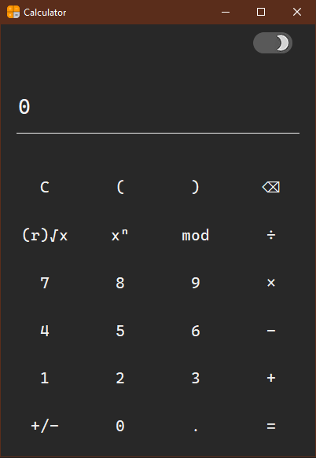
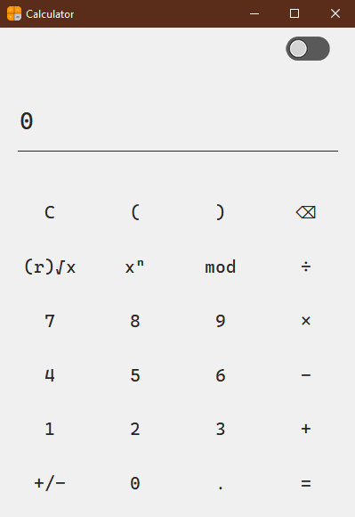

# Calculator

-   [Calculator](#Calculator)
    - [About](#About)
    - [Dark Mode](#Dark-Mode)
    - [SQRT Root](#SQRT-Root)
    - [Keyboard Support](#Keyboard-Support)

## About

A simple calculator made with python and tkinter module.

## Dark Mode

This app comes with both DarkMode and LightMode,  
which can be changed by the switch in top-right corner. 

## SQRT Root

For using sqrt function, be aware to write the root  
before pressing the '√' operator and then write the number.  
As an example 3√8 gives you 2.

## Keyboard Support

All numbers and operators can be used with keyboard  
instead of using them by clicking with mouse.