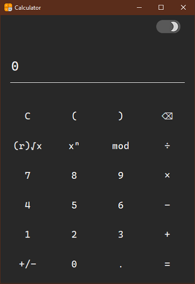

# Calculator

-   [Calculator](#Calculator)
    -   [About](#About)
    -   [Dark Mode](#Dark-Mode)
    -   [SQRT](#SQRT)
    -   [Keyboard Support](#Keyboard-Support)
    -   [License](#License)

## About

A simple calculator made with python and tkinter module.

## Dark Mode

This app comes with both DarkMode and LightMode, which can be changed by the switch in the top-right corner.

## SQRT

For using the sqrt function, make sure to write the root before pressing the '√' operator and then write the number.  
For example 3√8 gives you 2.

## Keyboard Support

All numbers and operators can be used with keyboard instead of using them by clicking with mouse.

## License

